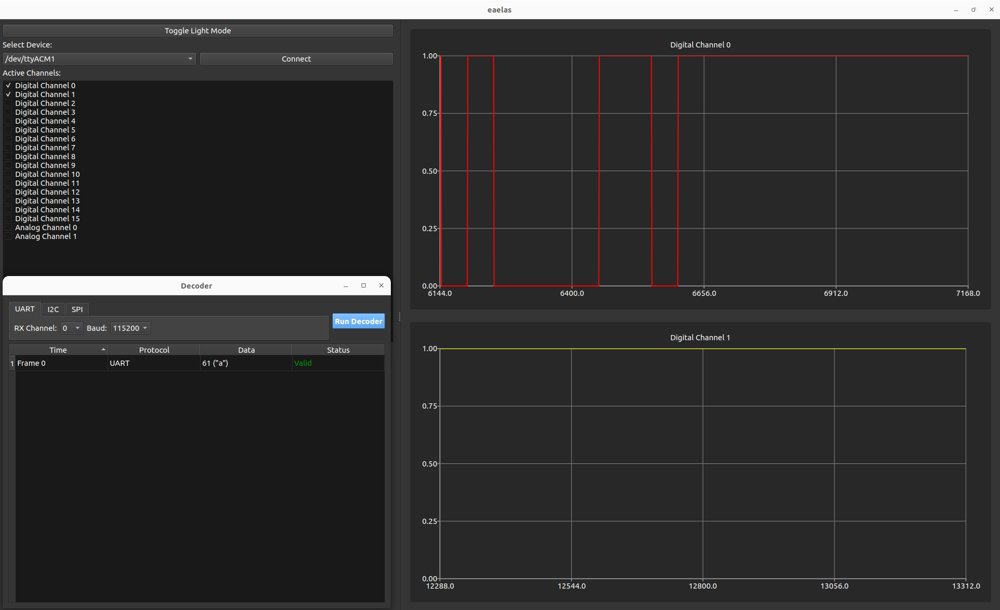
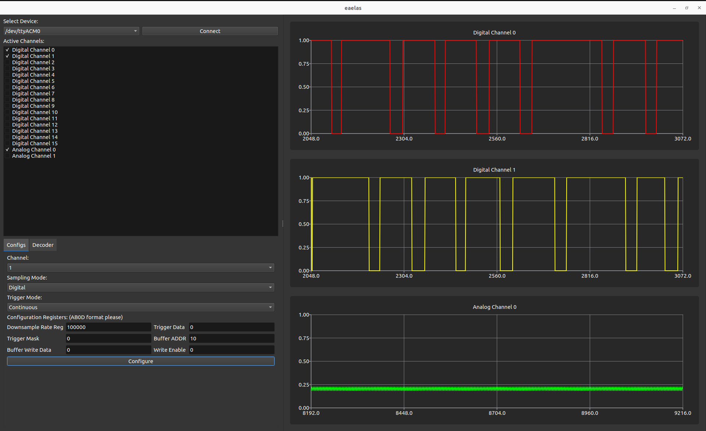

# Needed packages
### All needed installs for UBUNTU
sudo apt update
sudo apt install -y \
    build-essential \
    cmake \
    git \
    libgl1-mesa-dev \
    qt6-base-dev \
    libqt6serialport6-dev \
    libqt6charts6-dev

# Create and configure the build directory
cmake -S . -B build
### Clean the build
cmake --build build --target clean

### Or remove the directory
rm -rf build/

# Screenshots of the GUI

# Overview
This GUI is meant to mimic that of Saleae's logic analyzer software for our CPRE 488 embedded system design project where we built a logic analyzer on an FPGA. This was built using C++ to have better memory managment abilities for large datasets than a language such as python as latency was an initial concern for our group. The QT6 framework was used for the GUI visualization as well as to handle button commands. An open source library called Reactive Plus Plus was used to handle the serial communication from the FPGA to the GUI. This was setup in a separate thread to not hinder the latency of the GUI display.

# Drawbacks/Future Considerations
This GUI currently is not set up for a smooth continuous stream of data. Currently this GUI will update the graph with the expected number of samples coming from the FPGA (1024 samples). This was not deemed as necessary as we were not able to use enough bram space to have a continous stream we instead used a button input to start a "continous" stream that would gather 1024 samples then dump that buffer over UART to the GUI.

In the future if continous streams are desired a different protocol than UART should be used for communication between the FPGA and the GUI due to the limiting factor of the FPGA's max baud rate of 384000.

Currently only a UART decoder is implemented and it is sketch. We simply ran out of time for this final project and had to get something working for the demo. This largely is down to a skill issue where we needed a better way to infer timing for UART. It techinically works as is for a very specific UART signal we used to test...

There currently is no scrolling feature to view previous samples on a given channel. This is a feature I had hoped to add but instead had focus on core requirements such as configuration and decoding.